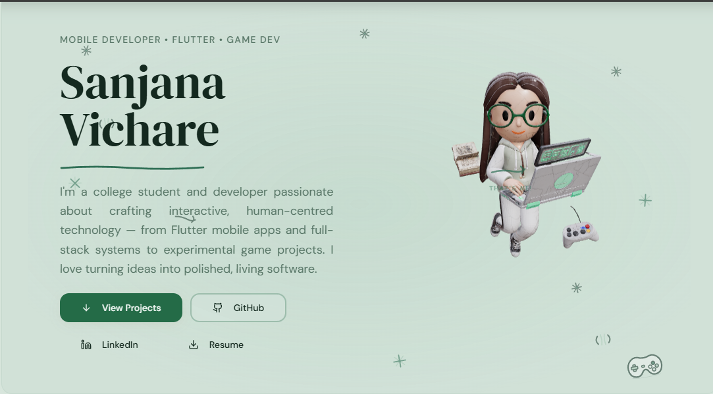

# ✨ Sanjana's Interactive Developer Portfolio

An immersive portfolio showcasing creative development, 3D web experiences, and modern UI design.

## 🚀 Live Website

[(Add your deployed link here](https://sanjana-interactive-portfolio.vercel.app/)

---

## 📸 Preview

---

## 🛠 Tech Stack

Frontend
• React
• Vite
• TypeScript

Styling
• TailwindCSS
• shadcn/ui

3D & Animation
• Three.js
• React Three Fiber
• Drei
• Framer Motion

Icons
• Lucide React

---

## ✨ Features

• Interactive 3D developer avatar
• Smooth page animations
• Modern responsive UI
• Animated hero section
• Service cards with hover effects
• Downloadable resume

---

## 📂 Project Structure

src
┣ components
┣ pages
┣ assets
┗ App.tsx

public
┗ images

---

## ⚡ Run Locally

Clone the project

git clone https://github.com/SanjanaVichare/sanjana-interactive-portfolio.git

Install dependencies

npm install

Run the development server

npm run dev

---

## 👩‍💻 Author

Sanjana Vichare

Creative Developer | Game Developer | Problem Solver

GitHub
https://github.com/SanjanaVichare
